# OP_STATE_MACHINE.md

Stand: 2026-03-27

Vollstaendige Uebersicht der aktuellen `Op`-/State-Machine in `sunray-core`.
Die Darstellung basiert auf dem echten Code in `core/op/*.cpp` und nicht auf aelteren Konzeptdokumenten.

## Hinweise

- `GpsWait` und `EscapeReverse` koennen als Rueckkehr-Zustaende arbeiten.
  Wenn sie mit `returnBackOnExit=true` aufgerufen wurden, setzen sie nach erfolgreicher Erholung auf den vorherigen Op zurueck.
- `EscapeForward` existiert als Op, wird aktuell aber nicht aktiv aus der normalen Maschine heraus angefordert.
- Operator-Kommandos (`start`, `stop`, `dock`, `charge`, `undock`, `navtostart`, `waitrain`, `error`) kommen ueber `OpManager::changeOperationTypeByOperator()`.

## Vollstaendiges Diagramm

```mermaid
stateDiagram-v2
    [*] --> Idle

    Idle --> Charge: charger connected > 2 s
    Idle --> Dock: operator dock
    Idle --> Charge: operator charge
    Idle --> Error: operator error
    Idle --> WaitRain: operator waitrain
    Idle --> NavToStart: operator start\n(not charging)
    Idle --> Undock: operator start\n(charging)
    Idle --> Undock: operator undock
    Idle --> NavToStart: operator navtostart

    Undock --> NavToStart: charger released\nand distance reached
    Undock --> Error: charger still connected timeout
    Undock --> Error: position timeout
    Undock --> Error: obstacle
    Undock --> Error: lift
    Undock --> Error: motor fault
    Undock --> Idle: operator stop
    Undock --> Dock: operator dock
    Undock --> Charge: operator charge

    NavToStart --> Mow: target reached
    NavToStart --> Mow: no further waypoints
    NavToStart --> GpsWait: gps lost / kidnapped
    NavToStart --> Dock: gps fix timeout
    NavToStart --> EscapeReverse: obstacle
    NavToStart --> Error: lift
    NavToStart --> Error: motor fault
    NavToStart --> Error: imu tilt / imu error
    NavToStart --> Idle: route build failed
    NavToStart --> Idle: operator stop
    NavToStart --> Dock: operator dock
    NavToStart --> Charge: operator charge
    NavToStart --> Error: operator error

    Mow --> GpsWait: gps lost / kidnapped
    Mow --> Dock: gps fix timeout
    Mow --> Dock: battery low
    Mow --> Dock: timetable stop
    Mow --> Dock: no further waypoints
    Mow --> WaitRain: rain
    Mow --> EscapeReverse: obstacle
    Mow --> Error: lift
    Mow --> Error: motor fault
    Mow --> Error: imu tilt / imu error
    Mow --> Idle: route build failed
    Mow --> Idle: operator stop
    Mow --> Dock: operator dock
    Mow --> Charge: operator charge
    Mow --> Error: operator error

    WaitRain --> Idle: rain cleared
    WaitRain --> Dock: rain active away from dock
    WaitRain --> Dock: battery low while waiting
    WaitRain --> Idle: operator stop
    WaitRain --> Dock: operator dock
    WaitRain --> Charge: operator charge
    WaitRain --> Error: operator error

    Dock --> Charge: charger connected
    Dock --> GpsWait: gps lost / kidnapped
    Dock --> EscapeReverse: obstacle
    Dock --> Error: lift
    Dock --> Error: motor fault
    Dock --> Error: gps fix timeout
    Dock --> Error: docking retries exhausted
    Dock --> Error: retry routing failed
    Dock --> Idle: operator stop
    Dock --> Charge: operator charge
    Dock --> Error: operator error

    Charge --> Dock: charger disconnected unexpectedly
    Charge --> Dock: touch retry failed
    Charge --> Undock: timetable start\nand battery OK
    Charge --> Error: charging contact retries exhausted
    Charge --> Error: battery undervoltage
    Charge --> Charge: rain
    Charge --> Charge: charger reconnected
    Charge --> Charge: charging complete
    Charge --> Idle: operator stop
    Charge --> Dock: operator dock
    Charge --> Undock: operator start
    Charge --> Undock: operator undock
    Charge --> Error: operator error

    GpsWait --> Idle: gps recovered\nbut resume blocked by map change
    GpsWait --> Idle: gps recovered\nand no return target
    GpsWait --> Dock: gps fix timeout
    GpsWait --> Undock: gps recovered\nreturn target = Undock
    GpsWait --> NavToStart: gps recovered\nreturn target = NavToStart
    GpsWait --> Mow: gps recovered\nreturn target = Mow
    GpsWait --> Dock: gps recovered\nreturn target = Dock
    GpsWait --> EscapeReverse: gps recovered\nreturn target = EscapeReverse
    GpsWait --> EscapeForward: gps recovered\nreturn target = EscapeForward
    GpsWait --> Idle: operator stop
    GpsWait --> Dock: operator dock
    GpsWait --> Charge: operator charge
    GpsWait --> Error: operator error

    EscapeReverse --> Dock: outside perimeter during escape
    EscapeReverse --> Dock: still outside perimeter after reverse
    EscapeReverse --> Error: lift after escape
    EscapeReverse --> GpsWait: kidnapped
    EscapeReverse --> Error: imu tilt / imu error
    EscapeReverse --> Idle: reverse done\nwithout return target
    EscapeReverse --> Mow: reverse done\nreturn target = Mow
    EscapeReverse --> Dock: reverse done\nreturn target = Dock
    EscapeReverse --> NavToStart: reverse done\nreturn target = NavToStart
    EscapeReverse --> Idle: operator stop
    EscapeReverse --> Dock: operator dock
    EscapeReverse --> Charge: operator charge
    EscapeReverse --> Error: operator error

    EscapeForward --> GpsWait: kidnapped
    EscapeForward --> Error: imu tilt / imu error
    EscapeForward --> Idle: forward done\nwithout return target
    EscapeForward --> Mow: forward done\nreturn target = Mow
    EscapeForward --> Dock: forward done\nreturn target = Dock
    EscapeForward --> NavToStart: forward done\nreturn target = NavToStart
    EscapeForward --> Idle: operator stop
    EscapeForward --> Dock: operator dock
    EscapeForward --> Charge: operator charge
    EscapeForward --> Error: operator error

    Error --> Idle: operator stop / operator idle
    Error --> Dock: operator dock
    Error --> Charge: operator charge
    Error --> Error: all autonomous faults stay latched
```

## Praktische Lesart

- Normaler Start aus dem Dock:
  `Charge -> Undock -> NavToStart -> Mow`
- Normaler Missionsabbruch:
  `Mow -> Dock -> Charge`
- GPS-Kurzverlust:
  `Mow/NavToStart/Dock -> GpsWait -> Rueckkehr zum vorherigen Op`
- Hindernis:
  `Mow/NavToStart/Dock -> EscapeReverse -> Rueckkehr zum vorherigen Op`
- Regen:
  `Mow -> WaitRain -> Dock` oder `WaitRain -> Idle`, sobald der Regen endet
- Harte Fehler:
  `... -> Error`, danach nur noch manuelle Freigabe

## Codequellen

- `core/op/Op.cpp`
- `core/op/IdleOp.cpp`
- `core/op/UndockOp.cpp`
- `core/op/NavToStartOp.cpp`
- `core/op/MowOp.cpp`
- `core/op/WaitRainOp.cpp`
- `core/op/DockOp.cpp`
- `core/op/ChargeOp.cpp`
- `core/op/GpsWaitFixOp.cpp`
- `core/op/EscapeReverseOp.cpp`
- `core/op/ErrorOp.cpp`
